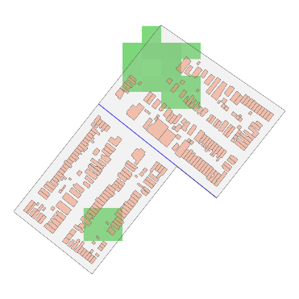

# Predicting Urban Heat Island Effects Using Spatial Data

## Overview 

Urban greenspaces have been extensively linked to numerous benefits for people living in densely built environments and form a key component of sustainable urban planning and development. However, the increasing demand for urban spaces (and their economic benefits) often conflicts with environmental preservation. This tension is particularly evident in two key areas: local pollution levels and surface temperatures. In fact, highly urbanized areas—dominated by impervious structures like concrete roads and buildings, and limited greenery—tend to exhibit elevated surface temperatures compared to nearby regions with lower urban density (Chi, Guangqing, as cited in Bohn, 2023).

This phenomenon is known as the **Urban Heat Island (UHI) Effect**. The United States Environmental Protection Agency (2014) describes it as follows:

> “Heat islands are urbanized areas that experience higher temperatures than outlying areas. Structures such as buildings, roads, and other infrastructure absorb and re-emit the sun’s heat more than natural landscapes such as forests and water bodies. Urban areas, where these structures are highly concentrated and greenery is limited, become ‘islands’ of higher temperatures relative to outlying areas. Daytime temperatures in urban areas are about 1–7°F higher than temperatures in outlying areas and nighttime temperatures are about 2–5°F higher.”

An increase in UHI intensity has significant repercussions for public health, air and water quality, and native species’ migration patterns (National Geographic, 2022). Currently, UHI measurement relies on deterministic processing of temperature readings (Chakraborty et al., 2020), meaning UHI effects can only be observed **ex post**—after an area is developed and observed over multiple seasons.

---

## About This Model

This project aims to **predict UHI effects** by analyzing the spatial distribution of key urban features—specifically buildings, street lines, and vegetative cover—across different geographical units. Two distinct datasets are employed, each representing major U.S. cities (Chicago, New York City, and Los Angeles). While both datasets capture spatial features, they differ in display mode, the amount of information each provides, and the observational units used.

### Datasets

In their raw form, the two experimental datasets look like this:

<table>
  <tr>
    <td>
      
    </td>
    <td>
      
    </td>
  </tr>
  <tr>
    <td align="center"><strong>Dataset A</strong></td>
    <td align="center"><strong>Dataset B</strong></td>
  </tr>
</table>

-- where dataset A represents a highly simplified image where only necessary charactersitics are extracted from spatial data, representing outlines similar to what may be produced during initial urban planning stages   
-- and dataset B represents composite images of areas where charactersitcis such as vegetation and roads are showin in their raw forms

For a full outline of my data creation, analytical methodology and results, I highly recommend reading the whitepaper available in my repo!

## Technicals

The `data` folder contains two subfolders with the datasets. This file needs to be unzipped first due to its size:
- `Source Raw Data` contains the raw dataset which is processed in the R script to create the final images used in training the model. Each city whose data is utilized in the final dataset has its source raw data in separate folders. Data sources include shape files for each city, census block group demarcation shapefiles, a buildings vector file, a roads vector file, green cover raster file, and UHI raster files.
- `Final Dataset_train_test_split` contains two subfolders:
  - `aerial_splits` which contains the final images in train-test split subfolders, which act as input to the aerial image classification models.
  - `segmented_splits` contains the final images in train-test split subfolders, which act as input to the segmented image classification models.

The `R scripts` folder contains two subfolders, one for creating the final aerial image dataset and another for creating the segmented images dataset. Each of these folders contains a unique script for Chicago, LA, and NY to process their data.of the format `Lahiri_Stage5__Subset_data_(cityname)_aerial` for processing aerial images 
an `Lahiri_Stage5__Subset_data_(cityname)` for processing segmented images.

`Python Scripts (htmls and notebooks)` contains three python scripts. These notebooks are shared in both html and ipynb formats:
- `Lahiri_Stage5_Descriptives_train_test_split` generates the descriptive statistics presented in the final report and shows the pipeline for stratified sampling and creation of train-test splits of images.
- `Lahiri_Stage5_Final_project_segmented_classification` notebook contains the full experimentation pipeline for training various CNNs, saves trained models, and creates sample feature maps for investigating segmented images.
- `Lahiri_Stage5_Final_project_aerial_classification` does the same for aerial images.

The final report and presentation are available as separate files in the overall folder.
